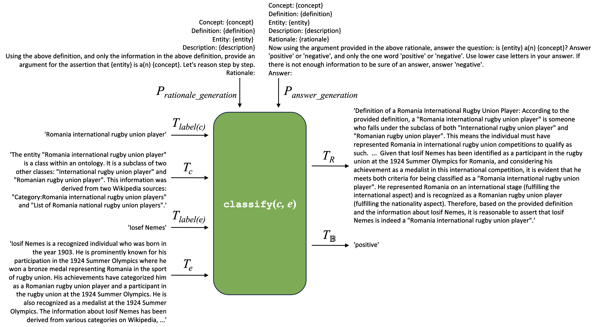

# evaluating-kg-class-memberships-using-llms
 Code and data for experiments on the evaluation of class membership relations in knowledge graphs using LLMs

 [Bradley P. Allen](https://orcid.org/0000-0003-0216-3930) and [Paul T. Groth](https://orcid.org/0000-0003-0183-6910)   
 [INtelligent Data Engineering Lab](https://indelab.org/)  
 University of Amsterdam, Amsterdam, The Netherlands

## Overview
A backbone of knowledge graphs are their *class membership relations*, which assign entities to a given class. As part of the knowledge engineering process, we propose a new method for evaluating the quality of these relations by processing descriptions of a given entity and class using a zero-shot chain-of-thought classifier that uses a natural language intensional definition of a class (Figure 1). This repository contains the data and code involved in an evaluation of this method.

<p align="center">
  
  <br>
  <em>Figure 1: A zero-shot chain-of-thought classifier applied to the class clgo:Romania international rugby union player and the entity clgr:Iosif Nemes from the CaLiGraph knowledge graph.</em>
</p>

We evaluated the method using two publicly available knowledge graphs, Wikidata and CaLiGraph, and 7 large language models. Using the gpt-4-0125-preview large language model, the method’s classification performance achieved a macro-averaged F1-score of 0.830 on data from Wikidata and 0.893 on data from CaLiGraph. Moreover, a manual analysis of the classification errors showed that 40.9% of errors were due to the knowledge graphs, with 16.0% due to missing relations and 24.9% due to incorrectly asserted relations. 

The principal contributions of this work are 1) a formal approach to the design of a neurosymbolic knowledge engineering workflow integrating KGs and LLMs, and 2) experimental evidence that this method can assist knowledge engineers in addressing the correctness and completeness of KGs, potentially reducing the effort involved in knowledge acquisition and elicitation.

## Paper
[Allen, B.P. and Groth, P.T., 2024. Evaluating Class Membership Relations in Knowledge Graphs using Large Language Models. arXiv preprint arXiv:2404.17000](https://arxiv.org/abs/2404.17000). Accepted to the European Semantic Web Conference Special Track on Large Language Models for Knowledge Engineering, Hersonissos, Crete, GR, May 2024.

## License
MIT.

## Requirements
- Python 3.11 or higher.
- OPENAI_API_KEY and HUGGINGFACE_API_TOKEN environment variables set to your respective OpenAI and Hugging Face API keys.

## Installation
    $ git clone https://github.com/bradleypallen/evaluating-kg-class-memberships-using-llms.git
    $ cd evaluating-kg-class-memberships-using-llms
    $ python -m venv env
    $ source env/bin/activate
    $ pip install -r requirements.txt

## Software and data artifacts in this repository

### Source code
- Classifier implementation: [classifier.py](src/classifier.py)
- Utilities for running experiments and displaying results: [utils.py](src/utils.py)

### Experiments
- Notebooks for executing experiments
    - Wikidata: [wikidata_experiment.ipynb](experiments/wikidata_experiment.ipynb)
    - CaLiGraph [caligraph_experiment.ipynb](experiments/caligraph_experiment.ipynb)
- Data sets
    - Wikidata: [wikidata_classes.json](experiments/wikidata_classes.json)
    - CaLiGraph: [caligraph_classes.json](experiments/caligraph_classes.json)
- Classification results
    - Wikidata
        - gemma-2b-it: [gemma-2b-it-wikidata.json](experiments/gemma-2b-it-wikidata.json)
        - gemma-7b-it: [gemma-7b-it-wikidata.json](experiments/gemma-7b-it-wikidata.json)
        - gpt-3.5-turbo: [gpt-3.5-turbo-wikidata.json](experiments/gpt-3.5-turbo-wikidata.json)
        - gpt-4.0-0125-preview: [gpt-4-0125-preview-wikidata.json](experiments/gpt-4-0125-preview-wikidata.json)
        - Llama-2-70b-chat-hf: [Llama-2-70b-chat-hf-wikidata.json](experiments/Llama-2-70b-chat-hf-wikidata.json)
        - Mistral-7b-instruct-v0.2: [Mistral-7B-Instruct-v0.2-wikidata.json](experiments/Mistral-7B-Instruct-v0.2-wikidata.json)
        - Mixtral-8x7B-Instruct-v0.1: [Mixtral-8x7B-Instruct-v0.1-wikidata.json](experiments/Mixtral-8x7B-Instruct-v0.1-wikidata.json)
    - CaLiGraph
        - gemma-2b-it: [gemma-2b-it-caligraph.json](experiments/gemma-2b-it-caligraph.json)
        - gemma-7b-it: [gemma-7b-it-caligraph.json](experiments/gemma-7b-it-caligraph.json)
        - gpt-3.5-turbo: [gpt-3.5-turbo-caligraph.json](experiments/gpt-3.5-turbo-caligraph.json)
        - gpt-4.0-0125-preview: [gpt-4-0125-preview-caligraph.json](experiments/gpt-4-0125-preview-caligraph.json)
        - Llama-2-70b-chat-hf: [Llama-2-70b-chat-hf-caligraph.json](experiments/Llama-2-70b-chat-hf-caligraph.json)
        - Mistral-7b-instruct-v0.2: [Mistral-7B-Instruct-v0.2-caligraph.json](experiments/Mistral-7B-Instruct-v0.2-caligraph.json)
        - Mixtral-8x7B-Instruct-v0.1: [Mixtral-8x7B-Instruct-v0.1-caligraph.json](experiments/Mixtral-8x7B-Instruct-v0.1-caligraph.json)

### Findings

#### Classifier performance
- Wikidata: [wikidata-classifier-performance.ipynb](wikidata-classifier-performance.ipynb)
- CaLiGraph: [caligraph-classifier-performance.ipynb](caligraph-classifier-performance.ipynb)

#### Error analysis
- Classifier errors using gpt-4-0125-preview: [gpt-4-0125-preview-errors.ipynb](gpt-4-0125-preview-errors.ipynb)
- Notebook for generating CSV files for import into spreadsheet application in support of human annotation for error analysis: [gpt-4-0125-preview-error-analysis-prep.ipynb](gpt-4-0125-preview-error-analysis-prep.ipynb)
- Generated CSV files for import into spreadsheets for human annotation
    - Wikidata: [wd_err.csv](error-analysis/wd_err.csv)
    - CaLiGraph: [cg_err.csv](error-analysis/cg_err.csv)
- Spreadsheets and CSV files with human annotations:
    - Wikidata: [wd_err_annotated.numbers](error-analysis/wd_err_annotated.numbers) (Numbers), [cg_err_annotated.csv](error-analysis/cg_err_annotated.csv) (CSV)
    - CaLiGraph: [cg_err_annotated.numbers](error-analysis/cg_err_annotated.numbers) (Numbers), [cg_err_annotated.csv](error-analysis/cg_err_annotated.csv) (CSV)
- Error analysis: [gpt-4-0125-preview-error-analysis.ipynb](gpt-4-0125-preview-error-analysis.ipynb)

## Usage

### Running the experiments
1. Delete the existing model-specific classification files in the ```/experiments``` subdirectory.
1. Execute [```wikidata_experiment.ipynb```](wikidata_experiment.ipynb) and [```caligraph_experiment.ipynb```](caligraph_experiment.ipynb) to run each of the seven LLMs over the data sets for Wikidata and CaLiGraph, respectively.
1. Occasionally, a given run will throw an error, typically due to an API timeout or other service-related problem. In those instances, simply re-execute the notebook, and the processing will restart after the last model and last class being processed.

### Viewing classifier performance metrics
1. Execute [```wikidata-classifier-performance.ipynb```](wikidata-classifier-performance.ipynb) and [```caligraph-classifier-performance.ipynb```](caligraph-classifier-performance.ipynb) to view the performance statistics for each of the seven LLMs' classifications for Wikidata and CaLiGraph, respectively. This can be done while experiments are being run, after the first model has processed the first class.

### Viewing classification errors
1. Execute [```gpt-4-0125-preview-errors.ipynb```](gpt-4-0125-preview-errors.ipynb) to view the false positives and false negatives by gpt-4-0125-preview for each class in both Wikidata and CaLiGraph.
1. To view errors for another model, replace ```experiments/gpt-4-0125-preview-wikidata.json``` and ```experiments/gpt-4-0125-preview-caligraph.json``` with the appropriate model classification results files in the calls to ```display_errors```.

### Annotating classifications for error analysis
1. Execute [```gpt-4-0125-preview-error-analysis-prep.ipynb```](gpt-4-0125-preview-error-analysis-prep.ipynb) to generate the CSV files containing the classifications errors for the Wikidata and CaLiGraph experiments.
1. To generate CSV files for another model, replace ```experiments/gpt-4-0125-preview-wikidata.json``` and ```experiments/gpt-4-0125-preview-caligraph.json``` with the appropriate model classification results files in the calls to ```json.load```.
1. Using a spreadsheet application (e.g Excel or Numbers), import the generated CSV files, adding four columns with headers "missing data", "missing relation", "incorrect relation", and "incorrect reasoning" to the right.
1. For each row, annotate the cells in the new columns in the following manner, such that only one for these four cells in the row should be marked 'True', and the others marked 'False':
    - If the error is due to missing data in the entity description, mark "missing data" 'True', else 'False'.
    - If the error is due to a missing relation in the knowledge graph, mark "missing relation" 'True', else 'False'.
    - If the error is due to an incorrect relation in the knowledge graph, mark "incorrect relation" 'True' else 'False'.
    - If the error is due to missing data in the entity description, mark "incorrect reasoning" 'True' else 'False'.
1. Export the annotated spreadsheets for Wikidata and CaLiGraph to [```error-analysis/wd_err_annotated.csv```](error-analysis/wd_err_annotated.csv) and [```error-analysis/cg_err_annotated.csv```](error-analysis/cg_err_annotated.csv), respectively.

### Viewing the error analysis
1. Execute [```gpt-4-0125-preview-error-analysis.ipynb```](gpt-4-0125-preview-error-analysis.ipynb) to view the results of the error analysis.
